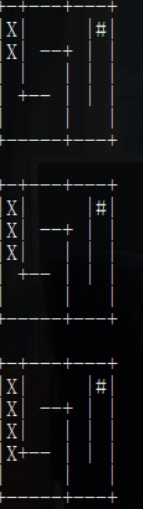

# KLEE #
## 实验环境 ##
- docker
- KLEE
- LLVM
- clang

## KLEE安装配置 ##
- 在虚拟机中下载安装docker
  - 在apt-cache madison docker-ce步骤中，选择版本5:19.03.11~3-0~ubuntu-bionic
  - 启动docker：sudo service docker start
- Pulling from the Docker Hub
- 创建KLEE Docker容器 - 即建即销毁

  ```
  docker run --rm -ti --ulimit='stack=-1:-1' klee/klee
  ```

- 创建持久性的容器
  ```
  docker run -ti --name=my_first_klee_container --ulimit='stack=-1:-1' klee/klee
  # 查看存在的docker
  docker ps -a
  # exit docker
  docker start -ai my_first_klee_container
  # 不需要时
  docker rm my_first_klee_container
  ```
- 在Docker镜像中，klee用户拥有sudo访问权限（密码为klee）

## 使用过程 ##
### 1、函数测试 ###
- /home/klee/klee_src/examples/get_sign目录下的get_sign.c
    ```
    /*
    * First KLEE tutorial: testing a small function
    */

    #include <klee/klee.h>

    int get_sign(int x) {
        if (x == 0)
            return 0;
        
        if (x < 0)
            return -1;
        else 
            return 1;
    } 

    int main() {
        int a;
        klee_make_symbolic(&a, sizeof(a), "a");
        return get_sign(a);
    } 
    ```
    - 在symbolic input上运行它
    - 要将变量标记为符号变量，使用klee_make_symbolic（）函数，在klee / klee.h中定义
    - 该函数带有三个参数：地址（内存位置），大小，名称

- KLEE使用LLVM bitcode进行操作
  - 首先使用clang -emit-llvm将其编译为LLVM位代码
  - 进入/home/klee/klee_src/examples/get_sign目录输入

    ```bash
    clang -I ../../include -emit-llvm -c -g -O0 -Xclang -disable-O0-optnone get_sign.c

    # 会在同目录下create a get_sign.bc file in LLVM bitcode format
    # 使用-I参数，以便编译器可以找到klee / klee.h，其中包含用于与KLEE虚拟机进行交互的内在函数的定义，例如klee_make_symbolic
    # -c只想将代码编译到目标文件（而不是本机可执行文件）
    # -g导致其他调试信息存储在目标文件中，KLEE将使用该信息来确定源行号信息、生成源行级统计信息
    # -O0 -Xclang -disable-O0-optnone用于进行编译而不会进行任何优化，但不会阻止KLEE进行自身的优化，而使用-O0进行编译则是最优化的
    ```
- 同目录下生成一个get_sign.bc字节码文件，进行测试klee get_sign.bc

  - 简单函数有3条路径，a等于0，a小于0，a大于0。对于探索的每条道路，KLEE执行的输出是一个目录，其中包含KLEE生成的测试用例,KLEE将输出目录命名为klee-out-N，其中N是可用的最小数字，并且还会为了方便生成一个名为klee-last的符号链接到该目录

- KLEE生成的测试用例(ktest-tool klee-last/test000001(2,3).ktest)


  - 在每个测试文件中，KLEE都会报告调用程序的参数，该路径上的符号对象的数量（在本例中只有一个），符号名称对象（'a'）及其大小（4）
  - 实际测试本身由输入值表示：第一个测试为0，第二个测试为16843009，最后一个测试为-2147483648。正如预期的那样，KLEE生成了值0，一个正值（16843009）和一个负值（-2147483648）

### 2、正则表达式库测试 ###
- /home/klee/klee_src/examples/regexp目录下的Regexp.c，包含一个正则表达式匹配功能
- 编译源代码，在同目录下生成`Regexp.bc`
  ```
  clang -I ../../include -emit-llvm -c -g -O0 -Xclang -disable-O0-optnone Regexp.c
  ```


- 用KLEE执行代码
  ```bash
  klee --only-output-states-covering-new Regexp.bc
  ```


  - 启动时，KLEE将打印用于存储输出的目录（在本例中为klee-out-0）。默认情况下，KLEE将使用第一个空闲的klee-out-N目录，并创建一个klee-last符号链接，该链接指向最新创建的目录
  - 发生错误：在KLEE运行时，它将打印“重要”事件的状态消息，例如，在程序中发现错误时。在这种情况下，KLEE在我们的测试程序的第23和25行上检测到两次无效的内存访问


    - 对于所有程序错误，KLEE都会在.err文件中写入一个简单的回溯(backtrace)，backtrace的每一行列出了帧号，指令行（这是在assembly.ll文件中与运行输出一起找到的行号），函数和参数（包括具体参数的值）以及源信息，特定的错误报告可能还包括其他信息。对于内存错误，KLEE将显示无效地址，以及该地址之前和之后的堆中有哪些对象。在这种情况下，我们可以看到该地址恰好是前一个对象末尾的一个字节，最后，当KLEE完成执行时，它会打印出一些有关运行的统计信息。在这里KLEE总共执行了4848113条指令，探索了7438条路径，并生成了15个测试用例，KLEE仅生成15个测试用例，因为命令将测试生成限制为使用--only-output-states-covering-new覆盖实际上覆盖新代码的状态。如果我们忽略此标志，KLEE将创建很多个个测试用例，尽管如此，KLEE并没有为每个路径创建一个测试用例。每当发现错误时，都会为到达该错误的第一个状态创建测试用例。在相同位置到达该错误的所有其他路径均被静默终止。许多现实的程序都具有无数（或非常多）的路径，并且KLEE通常不会终止。默认情况下，KLEE会一直运行到用户按下Control-C（即klee获得SIGINT）为止，但是还有其他选项可以限制KLEE的运行时和内存使用情况：-max-time=\<time span\>、-max-forks=N、-max-memory=N
- 出现错误的原因是输入正则表达式缓冲区完全具有符号性，但是match函数（Regexp.c的main函数下的函数）期望它是一个以null终止的字符串
- 解决方法 > 在将符号设置为符号后，在缓冲区的末尾存储“\0”，修改`Regexp.c`代码
 
```
  int main() {
    // The input regular expression.
    char re[SIZE];
    // Make the input symbolic.
    klee_make_symbolic(re, sizeof re, "re");
    re[SIZE - 1] = '\0';
    // Try to match against a constant string "hello".
    match(re, "hello");
    return 0;
  }
```

- 报错消失


### 3、KLEE迷宫测试 ###
- 修改[官网示例代码](https://pastebin.com/raw/6wG5stht)
- 进入maze目录，wget https://pastebin.com/raw/6wG5stht，存为maze-copy.c，添加头文件#include <unistd.h>，然后进行编译gcc maze-copy.c -o maze-copy，执行./maze-copy



## KLEE运行 ##
- 根据官网

```
# 为了使用KLEE进行测试，我们需要将代码中的某些内容标记为符号，让我们将所有迷宫输入标记为符号
# 这是迷宫代码在主要功能开始时读取的动作数组，KLEE将获得一系列动作的“符号控制”
# 将.c文件中的read(0,program,ITERS);修改为 klee_make_symbolic(program,ITERS,"program");
# 加上头文件 #include<klee/klee.h>
clang -c -I ../klee_src/include -emit-llvm ./maze-copy.c -o ./maze-copy.bc
klee maze-copy.bc
# KLEE将从任何输入中找到所有可能的代码/迷宫路径。如果其中一些路径导致典型的错误情况（例如内存故障等），则KLEE会发出信号
```


```
ls klee-last
ktest-tool klee-last/test000309.ktest
```


- 区分正常的测试用例和成功的测试用例

  ```
  printf ("You win!\n");
  klee_assert(0);  //Signal The solution!!
  ```

- 重新运行，通过assert.err后缀名辨别出是成功的测试用例，并且查看
  ```
  ls -1 klee-last/ |grep -A2 -B2 err
  # 假如列出了test000098.assert.err
  ktest-tool klee-last/test000098.ktest
  ```


- 使用klee --emit-all-errors maze_klee.bc，只需要一种方法可达到错误状态，因此KLEE不会显示达到相同错误状态的其他方法，所以需要测试所有路径，得到四个解决方法


## 参考资料 ##
- [KLEE入门](https://blog.csdn.net/vincent_nkcs/article/details/85224491)
- [KLEE迷宫](https://pastebin.com/raw/6wG5stht)
- [KLEE 符号执行工具的实例](https://blog.csdn.net/weixin_43996899/article/details/91986394)


