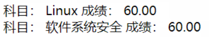

# SQL注入 #
## 实验过程 ##
### 代码效果 ###
- sql_injection.py代码

```
# -*- coding: utf-8 -*-

import sys
import cgi
from http.server import HTTPServer, BaseHTTPRequestHandler


class MyHTTPRequestHandler(BaseHTTPRequestHandler):
    field_name = 'a'
    form_html = \
        '''
        <html>
        <body>
        <form method='post' enctype='multipart/form-data'>
        <input type='text' name='%s'>
        <input type='submit'>
        </form>
        </body>
        </html>
        ''' % field_name

    def do_GET(self):
        self.send_response(200)
        self.send_header("Content-type", "text/html")
        self.end_headers()
        self.wfile.write(self.form_html.encode())


    def do_POST(self):
        form_data = cgi.FieldStorage(
            fp=self.rfile,
            headers=self.headers,
            environ={
                'REQUEST_METHOD': 'POST',
                'CONTENT_TYPE': self.headers['Content-Type'],
            })
        fields = form_data.keys()
        if self.field_name in fields:
            input_data = form_data[self.field_name].value
            # 单表查询，只显示pk，不显示课程名。
            #sql = 'SELECT course_id, score FROM edu_admin_score WHERE student_id = %s' % input_data
            # 多表查询，通过成绩表中课程fk查出课程名。
            sql = 'SELECT edu_admin_course.name, edu_admin_score.score FROM edu_admin_score INNER JOIN edu_admin_course ON edu_admin_score.course_id=edu_admin_course.id WHERE student_id = %s ' % input_data
            print(sql)
            import sqlite3
            conn = sqlite3.connect('db.sqlite3')
            c = conn.cursor()
            query_result = c.execute(sql)
            response_content = ''
            for i in query_result:
                #response_content += '科目： %i 成绩： %.2f <br>' % i
                response_content += '科目： %s 成绩： %.2f <br>' % i
            conn.close()
            print(response_content)
            self.send_response(200)
            self.send_header("Content-type", "text/html;charset=utf-8")
            self.end_headers()
            self.wfile.write(( "<html><body>%s</body></html>" %response_content ).encode('UTF-8') )


class MyHTTPServer(HTTPServer):
    def __init__(self, host, port):
        print("run app server by python!")
        HTTPServer.__init__(self,  (host, port), MyHTTPRequestHandler)


if '__main__' == __name__:
    server_ip = "0.0.0.0"
    server_port = 8080
    if len(sys.argv) == 2:
        server_port = int(sys.argv[1])
    if len(sys.argv) == 3:
        server_ip = sys.argv[1]
        server_port = int(sys.argv[2])
    print("App server is running on http://%s:%s " % (server_ip, server_port))

    server = MyHTTPServer(server_ip, server_port)
    server.serve_forever()
```

- 通过用户输入拼接sql语句
```
sql = 'SELECT edu_admin_course.name, edu_admin_score.score FROM edu_admin_score INNER JOIN edu_admin_course ON edu_admin_score.course_id=edu_admin_course.id WHERE student_id = %s ' % input_data
 ```

- 调用查询
    ```
    import sqlite3
    conn = sqlite3.connect('db.sqlite3')
    c = conn.cursor()
    query_result = c.execute(sql)
    response_content = ''
    for i in query_result:
        #response_content += '科目： %i 成绩： %.2f <br>' % i
        response_content += '科目： %s 成绩： %.2f <br>' % i
    conn.close()
    ```
- 效果




### 调试与查询 ###
- 运行python sql_injections.py
- 在vscode中调试，增加launch.json的配置

- 在调试界面，点击 “增加配置”，选python当前文件。然后在 launch.json中，会增加一个配置项，然后点击sql_inejction文件，使其成为编辑器的当前文件，就可以调试了。
  
- 运行以后，是一个编辑框，输入学生ID，查询对应的成绩。
- 通过直接查询数据库，我们知道当前的用户的ID是1，所以输入1，查询返回用户id 1的成绩。

### sql注入 ###

- sql_inject漏洞：往输入框中输入`1 OR 1=1`

- 查出了当前系统中所有用户的成绩，获得了整个数据库数据

- 在代码的43行，我们直接把用户输入的数据，作为sql语句中的查询条件。最后的sql语句为：

```sql
SELECT edu_admin_course.name, edu_admin_score.score FROM edu_admin_score INNER JOIN edu_admin_course ON edu_admin_score.course_id=edu_admin_course.id WHERE student_id = 1 OR 1=1
```
- 查询条件变成了 student_id = 1 OR 1=1，1=1恒为真，相当于:

```sql
SELECT edu_admin_course.name, edu_admin_score.score FROM edu_admin_score INNER JOIN edu_admin_course ON edu_admin_score.course_id=edu_admin_course.id WHERE true;
```
- 或者没有WHERE，变成了无条件查询，于是显示出了数据中的所有记录。

## 参考资料 ##
- [常见的Web漏洞——SQL注入](https://blog.csdn.net/qq_32261191/article/details/80801052)