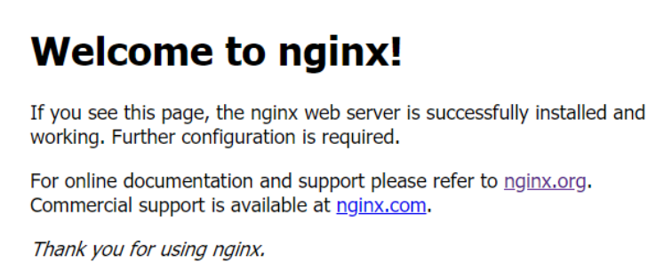
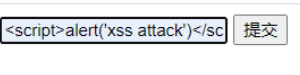
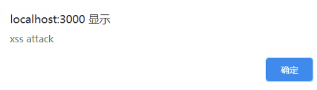
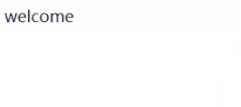
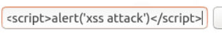
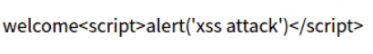

# XSS攻击 #
## 实验过程 ##

### Windows下PHP环境环境搭建(用vscode php插件) ###
- 官网下载PHP
- 复制根目录下的 php.ini-development 并改名为 php.ini，作为PHP的配置文件
- 打开php.ini，修改配置信息:
  - 取消`; extension_dir = "ext" `的注释
  - 启用需要加载的扩展文件
        ```
        extension=curl
        extension=gd2
        extension=mbstring
        extension=mysql
        extension=pdo_mysql
        extension=xmlrpc
        ```
- 将`E:\php`添加至环境变量
- vscode插件：php server(Serve Project)可以在浏览器直接运行 

### Windows下Apache / Nginx +php环境搭建 ###
（一般选择Linux来搭建web）
#### Windows Apache ####
- 下载Apache
- 进入`Apache`目录，打开`conf`目录找到`httpd.conf`
  ```conf
  # 将c:/Apache24修改为自己对应的盘符
  Define SRVROOT "c:/Apache24" 
  ServerRoot "${SRVROOT}"
  ```
- 在浏览器输入`localhost`即可进入主页

#### Apache + php ####
- Apache 通常用 TS 版
- 将自己的php文件放入`Apache24/htdocs`目录下
- 编辑Apache的httpd.conf
  - 查找LoadModule，在配置文件尾部加入
    ```conf
    LoadModule php7_module E:/php/php7apache2_4.dll
    PHPIniDir E:/php
    ```
  - 查找AddType  
    ```conf
    AddType application/x-httpd-php .php .html .htm
    <IfModule dir_module>
        DirectoryIndex index.html test.php
    </IfModule>
    ```
- 保存配置
- 启动apache服务，在浏览器中输入`localhost/test.php`

#### Windows Nginx
- 下载Nginx，直接在浏览器地址栏输入网址`http://localhost:80`，出现以下页面说明启动成功

  ```
  # 查看端口是否被占用
  netstat -ano | findstr "127.0.0.1:80"
  # 根据端口，查看对应的服务程序
  tasklist | findstr ""
  # 查看nginx是否启动成功
  tasklist /fi "imagename eq nginx.exe" 
  ```
- 关闭nginx
    ```
    # 如果使用cmd命令窗口启动nginx，关闭cmd窗口是不能结束nginx进程的，可使用两种方法关闭nginx
    # 1. 输入nginx命令 nginx -s stop(快速停止nginx)  或  nginx -s quit(完整有序的停止nginx)
    # 2. 使用taskkill：taskkill /f /t /im nginx.exe
    ```

#### Nginx + php ####

- 在php.ini中找到cgi.fix_pathinfo(用来设置在cgi模式下PHP是否提供PATH_INFO信息)，取消注释
- 把自己的文件放入nginx的html的目录下
- 修改conf目录下的nginx.conf文件，修改完重新启动nginx
    ```conf
    location ~ \.php$ {
        root           html;
        fastcgi_pass   127.0.0.1:9001;
        fastcgi_index  index.php;
        fastcgi_param  SCRIPT_FILENAME $document_root$fastcgi_script_name; 
        include        fastcgi_params;
    }
    ```
- 开启php-cgi.exe：`php-cgi.exe -b 127.0.0.1:9001 -c php.ini` 
- 访问`localhost/indes.php`可成功

### XSS攻击 ###
- `index.html`点击提交后，数据提交给`index.php`文件处理，如果是文本内容则会显示`welcome text`，如果是js代码则会出现js代码想要实现的效果
- 编写[`index.html`](./code/index.html)和[`index.php`](./code/index.php)文件，index.php和index.html位于同目录下，因为index.html中的action会调用index.php
    ```html
    <html>
    <body>
        <form method="post" action="index.php">
            <input type="text" name="name">
            <button>提交</button>
        </form>
    </body>
    </html>
    ```
    ```php
    <?php
        $name= $_POST["name"];
        echo "welcome $name";
    ?>
    ```
- xss攻击过程：`<script>alert('xss attack')</script>`




- 也可以直接运行php文件，实验结果和上面一样
  ```
  <html>
  <body>
    <?php
        if(isset($_POST["name"]) && $_POST["submit"]=="提交"){
            $name=$_POST["name"];
            echo "welcome $name";
        }
    ?>
    <form name="form" method="post" action="">
        <input type="text" name="name">
        <input type="submit" name="submit">
    </form>
  </body>
  </html>
  ```
  - 此处action为空，即form没有指定action地址，默认提交到当前url

## 预防XSS攻击 ##
- PHP htmlspecialchars() 函数
  - 把预定义的字符如 "<" （小于）和 ">" （大于）转换为 HTML 实体
  - 预定义的字符是
    ```
    & （和号）转义成为 &符号
    " （双引号）转义成为 "符号
    ' （单引号）转义成为 '符号
    < （小于）转义成为 <符号
    > （大于）转义成为 >符号
    ```
  - 第二个参数
    ```
    ENT_COMPAT - 默认。仅编码双引号。
    ENT_QUOTES - 编码双引号和单引号。
    ENT_NOQUOTES - 不编码任何引号
    ```
  - php部分为
    ```php
    <?php
        if(isset($_POST["name"]) && $_POST["submit"]=="Submit Query"){
            $name=$_POST["name"];
            echo "welcome ";
            echo htmlentities($name, ENT_QUOTES);
        }
    ?>
    ```
  - 结果



## 参考资料 ##
- [xss攻击概况](https://www.cnblogs.com/tugenhua0707/p/10909284.html)
- [nginx安装](https://www.runoob.com/linux/nginx-install-setup.html)


