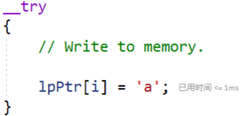

# 内存管理 #
## 实验要求 ##
- 阅读VirtualAlloc、VirtualFree、VirtualProtect等函数的官方文档
- 编程使用malloc分配一段内存，测试是否这段内存所在的整个4KB都可以写入读取
- 使用VirtualAlloc分配一段可读可写的内存，写入内存，然后将这段内存改为只读，再读数据和写数据，看是否会有异常情况。然后VirtualFree这段内存，再测试对这段内存的读写释放正常

## 实验过程 ##
### malloc ###
- 编写代码

    ```cpp
    #include<stdio.h>
    #include<malloc.h>
    int main()
    {
        // sizeof获取了数据在内存中所占用的存储空间，以字节为单位来计数
        // win10 64bit C语言 sizeof(int) = 4B
        // 虚拟内存基本管理单元大小为4KB
        // 4B x 1024 = 4KB
        // 2B x 2048 = 4KB
        printf("int所占的字节数为sizeof(int) = %d\n", sizeof(int));
        int len1 = 1e2;
        int len2 = 1024;
        int* a = (int*)malloc(sizeof(int) * len1);
        // 4KB以内
        for (int i = 0; i < len2; i++) {
            a[i] = i;
        }
        for (int i = 0; i < len2; i++) {
            printf("a[%d]=%d ", i, a[i]);
        }
        puts("\n\n4KB success!!\n");
        // 超过4KB
        for (int i = len2; i < len2 + 100; i++) {
            a[i] = i;
        }
        for (int i = len2; i < len2 + 100; i++) {
            printf("a[%d]=%d ", i, a[i]);
        }
        puts("\n\nOver 4KB success!!\n\n");
        return 0;
    }
    ```

- 直接运行超过4KB后，会报错

- 调试的情况下超过4KB后，出现内存访问冲突异常和缓冲区溢出警告，但能够跑出结果


### 虚拟内存 ###
- 代码

```
// A short program to demonstrate dynamic memory allocation
// using a structured exception handler.

#include <windows.h>
#include <tchar.h>
#include <stdio.h>
#include <stdlib.h>             // For exit

#define PAGELIMIT 2            // Number of pages to ask for

LPTSTR lpNxtPage;               // Address of the next page to ask for
DWORD dwPages = 0;              // Count of pages gotten so far
DWORD dwPageSize;               // Page size on this computer

INT PageFaultExceptionFilter(DWORD dwCode)
{
    LPVOID lpvResult;

    // If the exception is not a page fault, exit.

    if (dwCode != EXCEPTION_ACCESS_VIOLATION)
    {
        _tprintf(TEXT("Exception code = %d.\n"), dwCode);
        return EXCEPTION_EXECUTE_HANDLER;
    }

    _tprintf(TEXT("Exception is a page fault.\n"));

    // If the reserved pages are used up, exit.

    if (dwPages >= PAGELIMIT)
    {
        _tprintf(TEXT("Exception: out of pages.\n"));
        return EXCEPTION_EXECUTE_HANDLER;
    }

    // Otherwise, commit another page.

    lpvResult = VirtualAlloc(
        (LPVOID)lpNxtPage, // Next page to commit
        dwPageSize,         // Page size, in bytes
        MEM_COMMIT,         // Allocate a committed page
        PAGE_READWRITE);    // Read/write access
    if (lpvResult == NULL)
    {
        _tprintf(TEXT("VirtualAlloc failed.\n"));
        return EXCEPTION_EXECUTE_HANDLER;
    }
    else
    {
        _tprintf(TEXT("Allocating another page.\n"));
    }

    // Increment the page count, and advance lpNxtPage to the next page.

    dwPages++;
    lpNxtPage = (LPTSTR)((PCHAR)lpNxtPage + dwPageSize);

    // Continue execution where the page fault occurred.

    return EXCEPTION_CONTINUE_EXECUTION;
}

VOID ErrorExit(LPTSTR lpMsg)
{
    _tprintf(TEXT("Error! %s with error code of %ld.\n"),
        lpMsg, GetLastError());
    exit(0);
}

VOID _tmain(VOID)
{
    LPVOID lpvBase;               // Base address of the test memory
    LPTSTR lpPtr;                 // Generic character pointer
    BOOL bSuccess;                // Flag
    DWORD i;                      // Generic counter
    SYSTEM_INFO sSysInfo;         // Useful information about the system

    GetSystemInfo(&sSysInfo);     // Initialize the structure.

    _tprintf(TEXT("This computer has page size %d.\n"), sSysInfo.dwPageSize);

    //dwPageSize = sSysInfo.dwPageSize;
    dwPageSize = 10;

    // Reserve pages in the virtual address space of the process.

    lpvBase = VirtualAlloc(
        NULL,                 // System selects address
        PAGELIMIT * dwPageSize, // Size of allocation
        MEM_RESERVE | MEM_COMMIT,          // Allocate reserved pages
        PAGE_READWRITE);       // Protection = no access
    if (lpvBase == NULL)
        //ErrorExit(TEXT("VirtualAlloc reserve failed."));
        ErrorExit(LPTSTR("VirtualAlloc reserve failed."));

    lpPtr = lpNxtPage = (LPTSTR)lpvBase;

    // Use structured exception handling when accessing the pages.
    // If a page fault occurs, the exception filter is executed to
    // commit another page from the reserved block of pages.

    for (i = 0; i < PAGELIMIT * dwPageSize; i++)
    {
        __try
        {
            // Write to memory.

            lpPtr[i] = 'a';
        }

        // If there's a page fault, commit another page and try again.

        __except (PageFaultExceptionFilter(GetExceptionCode()))
        {

            // This code is executed only if the filter function
            // is unsuccessful in committing the next page.

            _tprintf(TEXT("Exiting process.\n"));

            ExitProcess(GetLastError());

        }

    }
    
    for (i = 0; i < PAGELIMIT * dwPageSize; i++)
    {
        // Read from the memory
        printf("%d : %c\n", i, lpPtr[i]);
    }

    // Release the block of pages when you are finished using them.

    bSuccess = VirtualFree(
        lpvBase,       // Base address of block
        0,             // Bytes of committed pages
        MEM_RELEASE);  // Decommit the pages

    _tprintf(TEXT("Release %s.\n"), bSuccess ? TEXT("succeeded") : TEXT("failed"));

}
```
#### VirtualAlloc分配一段可读写内存 ####
- Memory Protection Constants
  
  | constant / value | explain | description | 
  | ---------------- | ------- | ----------- |
  | PAGE_READWRITE 0x04 | 可读可写 | Enables read-only or read/write access to the committed region of pages. If Data Execution Prevention is enabled, attempting to execute code in the committed region results in an access violation. |
  | PAGE_READONLY 0x02 | 只读 | Enables read-only access to the committed region of pages. An attempt to write to the committed region results in an access violation. If Data Execution Prevention is enabled, an attempt to execute code in the committed region results in an access violation. |

- Allocate reserved pages和Allocate commit pages的区别

  | Value | Meaning |
  | ----- | ------- |
  | MEM_COMMIT 0x00001000 | Allocates memory charges (from the overall size of memory and the paging files on disk) for the specified reserved memory pages. The function also guarantees that when the caller later initially accesses the memory, the contents will be zero. Actual physical pages are not allocated unless/until the virtual addresses are actually accessed. |
  | MEM_RESEVER 0x00002000 | Reserves a range of the process's virtual address space without allocating any actual physical storage in memory or in the paging file on disk. |
  
- 将代码中flProtect字段的PAGE_NOACCESS修改为PAGE_READWRITE，并且将flAllocationType字段修改为MEM_RESERVE|MEM_COMMIT
  ```
  lpvBase = VirtualAlloc(
		NULL,                 // System selects address
		PAGELIMIT * dwPageSize, // Size of allocation
		MEM_RESERVE | MEM_COMMIT,          // Allocate reserved pages
		PAGE_READWRITE);       // Protection = no access
  ```
- 读写正常





#### 释放该段内存 ####

- If a page is released, its state changes to free, and it is available for subsequent allocation operations. After memory is released or decommited, you can never refer to the memory again. Any information that may have been in that memory is gone forever. Attempting to read from or write to a free page results in an access violation exception.

- 在代码后追加读写操作，都会引发异常


    ```
    puts("After free: checking write...");
    for (i = 0; i < PAGELIMIT * dwPageSize; i++)
    {
        // Write to memory.

        lpPtr[i] = 'a';
    }

    puts("After free: checking read...");
    for (i = 0; i < PAGELIMIT * dwPageSize; i++)
    {
        // Read from the memory
        printf("%d : %c\n", i, lpPtr[i]);
    }
    ```

## 参考资料 ##
- [VirtualAlloc](https://docs.microsoft.com/en-us/windows/win32/api/memoryapi/nf-memoryapi-virtualalloc)
- [VirtualFree](https://docs.microsoft.com/en-us/windows/win32/api/memoryapi/nf-memoryapi-virtualfree)
- [VirtualProtect](https://docs.microsoft.com/en-us/windows/win32/api/memoryapi/nf-memoryapi-virtualprotect)