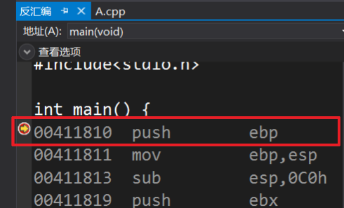
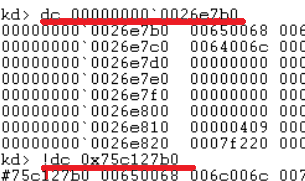

# 内存管理2 #
## 实验要求 ##
- 验证不同进程的相同的地址可以保存不同的数据。
 - 在VS中，设置固定基地址，编写两个不同可执行文件。同时运行这两个文件。然后使用调试器附加到两个程序的进程，查看内存，看两个程序是否使用了相同的内存地址；
 - 在不同的进程中，尝试使用VirtualAlloc分配一块相同地址的内存，写入不同的数据。再读出。
- 配置一个Windbg双机内核调试环境，查阅Windbg的文档，了解
 - Windbg如何在内核调试情况下看物理内存，也就是通过物理地址访问内存
 - 如何查看进程的虚拟内存分页表，在分页表中找到物理内存和虚拟内存的对应关系。然后通过Windbg的物理内存查看方式和虚拟内存的查看方式，看同一块物理内存中的数据情况

## 实验过程 ##
### 查看内存地址 ###
- 新建两个项目并写入代码


- 设置固定基址为"是"


- 下断点调试，依次点击调试，窗口，内存，打开内存窗口


- 两个程序使用了相同的内存地址，同时运行却能使用相同的地址，是因为使用的是虚拟地址，映射于不同的物理地址

### 相同地址内存对不同数据的读写 ###
- 使用VirtualAlloc分配一块相同地址的内存，写入不同的数据再读出
- 代码

```c
#include <windows.h>
#include <tchar.h>
#include <stdio.h>
#include <stdlib.h>             // For exit

int main() {
	printf("Demo A virtualalloc\n");

	LPVOID lpvBase;               // Base address of the test memory
	LPTSTR lpPtr;                 // Generic character pointer
	BOOL bSuccess;                // Flag
	DWORD i;                      // Generic counter
	SYSTEM_INFO sSysInfo;         // Useful information about the system

	GetSystemInfo(&sSysInfo);     // Initialize the structure.

	DWORD dwPageSize = sSysInfo.dwPageSize;
	// dwPageSize = 4096
	printf("%d\n", dwPageSize);

	// Reserve pages in the virtual address space of the process.
	int PAGELIMIT = 1;

	lpvBase = VirtualAlloc(
		(LPVOID)0x40000000,                 // System selects address
		PAGELIMIT*dwPageSize, // Size of allocation
		MEM_RESERVE | MEM_COMMIT,          // Allocate reserved pages
		PAGE_READWRITE);       // Protection = no access
	if (lpvBase == NULL)
	{
		_tprintf(TEXT("Error! %s with error code of %ld.\n"), TEXT("VirtualAlloc reserve failed."), GetLastError());
		exit(0);
	}

	lpPtr = (LPTSTR)lpvBase;

	// Write to memory.
	for (i = 0; i < PAGELIMIT*dwPageSize; i++) {
		lpPtr[i] = 'a';
	}

	// Read from memory
	for (i = 0; i < PAGELIMIT*dwPageSize; i++) {
		printf("%c", lpPtr[i]);
	}

	bSuccess = VirtualFree(
		lpvBase,       // Base address of block
		0,             // Bytes of committed pages
		MEM_RELEASE);  // Decommit the pages

	_tprintf(TEXT("\nRelease %s.\n"), bSuccess ? TEXT("succeeded") : TEXT("failed"));

	return 0;
}
```

- 调试项目1，观察字符a写入过程
- 61h是a的ascii值的16进制
- 执行完00411929 mov byte ptr [eax],61h后，查看eax寄存器，存的是a所在的地址


- 调试项目2


- 相同内存地址存入了不同的数据，证明不同进程相同内存地址可以保存不同的数据

### Windbg双机内核调试 ###
- windbg在主机上运行，通过虚拟串口连接win7虚拟机，虚拟机运行待调试的系统。

#### 虚拟机配置 ####
- 首先对虚拟机配置虚拟串口，目的是为了建立host到guest的调试通信连接。选择com1并且映射成为\\.pip\com_1

- 启动虚拟机，以管理员身份启动CMD，输入以下命令
  
  ```cmd
  # 设置端口1
  bcdedit /dbgsettings serial baudrate:115200 debugport:1
  
  # 复制一个开机选项，命名为“DebugEntry”，可任意命名
  
  # 增加一个开机引导项
  bcdedit /copy {current} /d DebugEntry

  # 激活debug
  bcdedit /displayorder {current} {替换第二个命令显示的UUID}
  bcdedit /debug {替换第二个命令显示的UUID} on
  ```

- 重启虚拟机，在开机的时候选择DebugEntry，系统正常启动


#### 主机配置 ####
- 安装windbg，路径为：xxx\Windows Kits\10\Debuggers\x64

- 启动虚拟机后，启动windbg

    ```cmd
    # 以管理员的身份打开cmd命令行
    windbg.exe -k com:port=\\.\pipe\com_1,baud=115200,pipe
    ```

- 如果因符号下载错误而无法访问网络，可参考[https://blog.csdn.net/xiangbaohui/article/details/103832850](https://blog.csdn.net/xiangbaohui/article/details/103832850)
- WINDBG从官网下载符号表需要搭建梯子根据自己的梯子，在命令行下输入
        
```
# 可以在windows的自动代理设置下查看
set _NT_SYMBOL_PROXY=127.0.0.1:1084
# 然后再用该命令行打开windbg
```


- 访问成功


- 在windbg的上方依次点击Debug，Break后，如果要让虚拟机继续，则输入g，虚拟机便可以重新使用

#### 使用WinDbg查看保护模式分页机制下的物理地址 ####
- 在主机windbg点击debug中的Go，在虚拟机中打开记事本编辑新文档，写入helloworld，然后点击WinDbg的break按钮，使操作系统断下来，使用 !process 0 0 命令查看当前系统所有进程信息，找到记事本所在进程，记事本进程的进程块起始地址为fffffa8002d0a060


- 使用.process -i fffffa8002d0a060(进程块地址)命令，输入 g 命令将WinDbg当前调试进程切换到notepad.exe，然后使用s -u命令在记事本进程中搜索 helloworld 字符串：s -u 0x00000000 L0x01000000 "helloworld"


- 虚拟地址及其二进制表示


- 目标进程的DirBase页表基址是`7652b000`


- PML4E的索引为0，所以目标PML4E项的值为0x3bf000007606e867，12~35位为0x07606e，低12位补零


- PDPTE的索引也为0，目标PDPTE项的值为 0x47b00000`76335867，PS位(第7位)为0，12~35位为 0x 076335 ，低12位补零


- 因为PDE的索引为1，所以我们要加上8，目标PDE项的值为 ：05000000`75cc8867，PS位(第7位)为0，12~35位为 0x75cc8，低12位补零，则：


- PTE的索引为0x6e，所以要加上0x6e*8,得到目标PTE项的值为：cab00000`75c12867，12~35位为 0x075c12，低12补零，得到页面物理基地址，再加上页面偏移，我们是0x7b0


#### windbg查看同一块物理内存中的数据 ####
- 通过Windbg的物理内存查看方式和虚拟内存的查看方式，看同一块物理内存中的数据情况
- 虚拟地址通过pte指令，找到页帧号pfn，pte对应的pfn为75c12，单位是4k（4096）

- 由pfn和相对地址，找到虚拟地址对应物理地址位置，pfn为0x75c12，则物理页地址是0x75c12000（0x75c12 × 0x1000），页内偏移是7b0 ，物理地址=物理页地址+页内偏移 = 0x75c12000+0x9e0 = 0x75c127b0


## 参考资料 ##
- [WinDBG 配置内核双机调试](https://www.cnblogs.com/LyShark/p/11547204.html)
- [Windbg虚拟机双机内核调试](https://blog.csdn.net/m0_37921080/article/details/82495063)
- [WinDbg 符号下载错误解决方案](https://blog.csdn.net/xiangbaohui/article/details/103832850)
