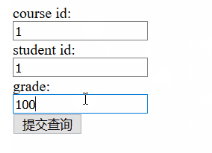
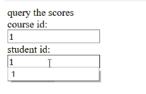
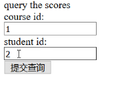
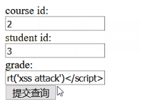

# 简易教务系统的web开发 #
## 实验要求 ##
- 在不使用Django的情况下，使用更底层的pyhton的sqlite库来编程操作数据库
- 在httpserver.py的基础上，继续编写漏洞
  - 一个是教师录入成绩页面的表单有三个字段，课程id，学生id，成绩。教师录入成绩提交以后，httpserver调用sqlite库使用sql语句写入数据库
  - 一个是学生查询成绩页面的表单有两个字段，学生id，课程id。学生输入信息后，httpserver使用sql语句查询成绩后返回给用户
  - 不需要做登录功能，课程用直接输入id的方式，而不是下拉菜单的方式或者其他选择的方式

## 实验过程 ##
### sqlite的使用 ###
- 创建一个数据库名为`edu_admin.db`，并且新建`teacher`表格
- 在sqlite数据库中创建表格字段的时候，允许不为字段申明数据类型
- 代码如下
    ```
    # -*- coding: utf-8 -*-
    import sqlite3
    conn = sqlite3.connect('./edu_admin.db')
    c = conn.cursor()
    # Create teacher table 
    c.execute('''CREATE TABLE teacher(courseid,studentid,grade)''')
    # Insert a row of data
    # c.execute("INSERT INTO teacher VALUES ('1','1','90')")
    # Save (commit) the change
    conn.commit()
    # We can also close the connection if we are done with it.
    # Just be sure any changes have been committed or they will be lost.
    conn.close()
    ```

### 编写教师录入成绩页面和学生查询成绩页面 ###
- 代码如下

```py
# -*- coding: utf-8 -*-

import sys
import cgi
from http.server import HTTPServer, BaseHTTPRequestHandler
import sqlite3

# 教师往数据库插入学生成绩
# 数据库为python自带轻量级数据库sqlite
def insert_into_db(course_id,student_id,grade):
    print("insert database")
    conn = sqlite3.connect('./edu_admin.db')
    c = conn.cursor()
    try:
        c.execute("select * from teacher where courseid = %s and studentid = %s " % (course_id,student_id))
        jud = c.fetchall()
        # 如果学生已有成绩，不允许重复插入
        if len(jud) == 0:
            c.execute("INSERT INTO teacher VALUES (%s,%s,%s)" %(course_id,student_id,grade))
            # Save (commit) the change
            conn.commit()
    except:
        print("already exist")
        conn.rollback()
    conn.close()

# 学生从数据库中查询成绩信息
def select_from_db(course_id,student_id):
    print("select database")
    conn = sqlite3.connect('./edu_admin.db')
    c = conn.cursor()
    try:
        c.execute("select * from teacher where courseid = %s and studentid = %s " % (course_id,student_id))
        res = c.fetchall()
        # 没有查到该学生的成绩
        if len(res) == 0:
            print("no student / no course")
            conn.close()
            return "error"
        else:
            conn.close()
            return res
    except:
        print("error")
        conn.close()
        return "error"

class MyHTTPRequestHandler(BaseHTTPRequestHandler):
    
    course_id = 'course_id'
    student_id = 'student_id'
    grade = 'grade'
    
    def do_GET(self):
        
        print("get success")

        path = self.path
        print(path)
        if path == "/grade":
            form_html = \
                '''
                <html>
                <body>
                <form method='post' enctype='multipart/form-data'>
                query the scores </br>
                course id:</br>
                <input type='text' name='%s'></br>
                student id:</br>
                <input type='text' name='%s'></br>
                <input type='submit'>
                </form>
                </body>
                </html>
                ''' % ('course_id','student_id')
            
            self.send_response(200)
            self.send_header("Content-type", "text/html")
            self.end_headers()
            self.wfile.write(form_html.encode())
                
        elif path == "/teacher": 
            form_html = \
                '''
                <html>
                <body>
                <form method='post' enctype='multipart/form-data'>
                course id:</br>
                <input type='text' name='%s'></br>
                student id:</br>
                <input type='text' name='%s'></br>
                grade:<br>
                <input type='text' name='%s'></br>
                <input type='submit'>
                </form>
                </body>
                </html>
                ''' % ('course_id','student_id','grade')
                
            self.send_response(200)
            self.send_header("Content-type", "text/html")
            self.end_headers()
            self.wfile.write(form_html.encode())

    def do_POST(self):
        print("post success")
        form_data = cgi.FieldStorage(
            fp=self.rfile,
            headers=self.headers,
            environ={
                'REQUEST_METHOD': 'POST',
                'CONTENT_TYPE': self.headers['Content-Type'],
            })
        fields = form_data.keys()
        # 需要判断是哪个页面进行了提交
        if len(fields) == 2:
            if self.course_id in fields and self.student_id in fields:
                course = form_data[self.course_id].value
                print(course)
                student = form_data[self.student_id].value
                print(student)
                # database
                res = select_from_db(course,student)
                print(res)
            
                if res == "error":
                    self.send_response(200)
                    self.send_header("Content-type", "text/html")
                    self.end_headers()
                    self.wfile.write(b"<html><body>query error </body></html>")
                else:
                    result = res[0]
                    result = result[2]
                    self.send_response(200)
                    self.send_header("Content-type", "text/html")
                    self.end_headers()
                    str = "<html><body>scores: %s </body></html>" % result
                    self.wfile.write(str.encode())
        else :
            if self.course_id in fields and self.student_id in fields and self.grade in fields:
                course = form_data[self.course_id].value
                print(course)
                student = form_data[self.student_id].value
                print(student)
                gra = form_data[self.grade].value
                print(gra)
                # file = open("."+self.path, "wb")
                # file.write("course_id: %s student_id: %s grade: %s \n" % (course,student,gra))
                
                # database
                insert_into_db(course,student,gra)

            self.send_response(200)
            self.send_header("Content-type", "text/html")
            self.end_headers()
            self.wfile.write(b"<html><body>OK</body></html>")

# MyHTTPServer类，是继承自原生的HTTPSever
class MyHTTPServer(HTTPServer):
    def __init__(self, host, port):
        print("run app server by python!")
        HTTPServer.__init__(self,  (host, port), MyHTTPRequestHandler)

# 程序入口
# 主函数沿用老师代码
if '__main__' == __name__:
    server_ip = "127.0.0.1"
    server_port = 8080
    if len(sys.argv) == 2:
        server_port = int(sys.argv[1])
    if len(sys.argv) == 3:
        server_ip = sys.argv[1]
        server_port = int(sys.argv[2])
    print("App server is running on http://%s:%s " % (server_ip, server_port))

    server = MyHTTPServer(server_ip, server_port)
    server.serve_forever()
```

### 结果显示 ###
- 录入



- 查询





- 进行存储型的xss攻击，这个代码由于插入使用的是%s，所以该条含有html标签的代码无法被插入到数据库中，但是如果程序未作处理，用户向数据库中写入恶意代码，还是能够展现在页面上，实现xss攻击。所以要在代码的处理和数据库两方面进行要求，防范xss等攻击。


